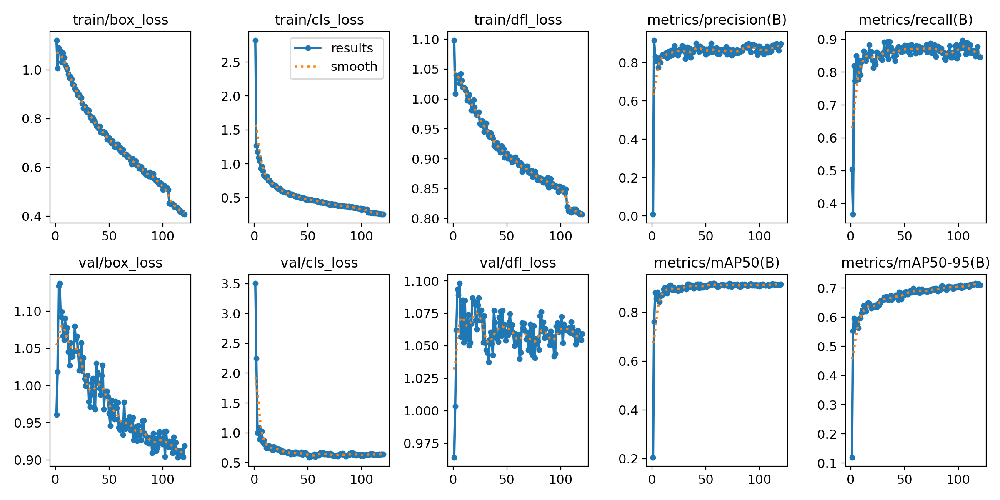
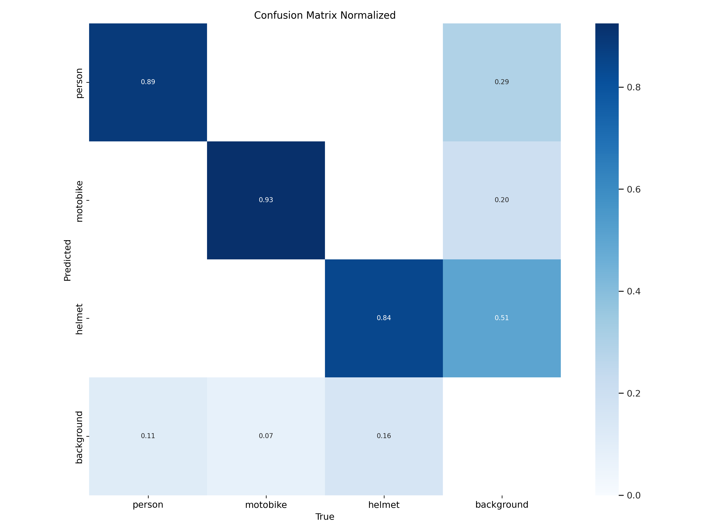
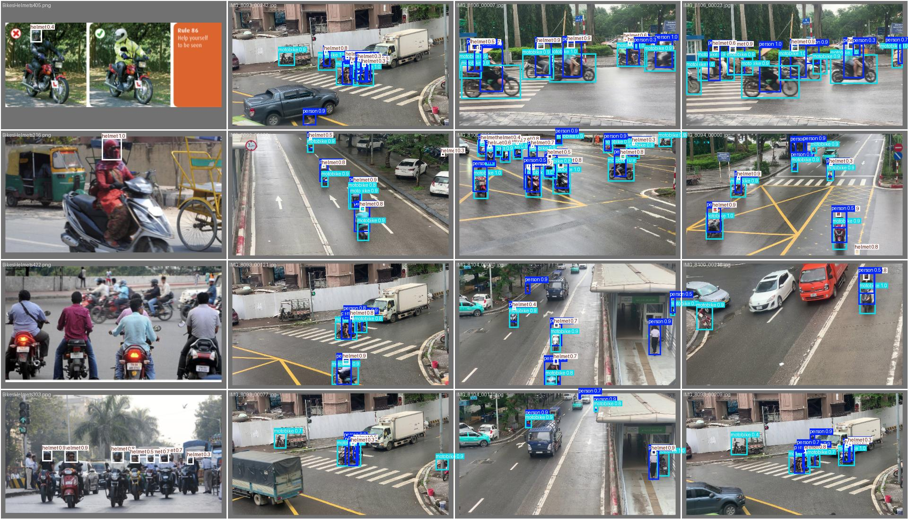
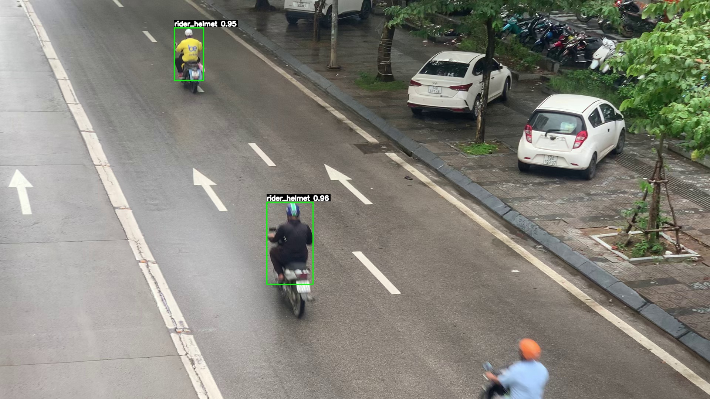

# Motorcyclist Helmet-Use Detection with YOLOv8m and Rule-Based Spatial Reasoning

This repository contains the implementation and selected reproducibility artifacts for a rider-level motorcycle helmet-use detection pipeline.

The system first fine-tunes YOLOv8m to detect three primitive classes:

```text
person, motorcycle, helmet
```

It then applies deterministic spatial reasoning to associate detected persons with motorcycles and helmets, producing rider-level labels:

```text
rider_helmet, rider_nohelmet
```

The corresponding paper is included as [`helmet_detection_comosa_en.pdf`](helmet_detection_comosa_en.pdf).

## Highlights

- Fine-tuned YOLOv8m detector for traffic-image helmet monitoring.
- Mixed dataset workflow combining public Pascal VOC annotations and custom YOLO annotations.
- Interpretable post-processing instead of a black-box rider classifier.
- Clear separation between validated detector metrics and qualitative rider-level outputs.

## Results

The selected run is `runs/helmet_yolov8m_person-bike-helmet3`. The paper reports the best validation row from this 120-epoch run, which occurs at epoch 57:

| Metric | Value |
| --- | ---: |
| Precision | 0.8740 |
| Recall | 0.8719 |
| mAP@0.5 | 0.9190 |
| mAP@0.5:0.95 | 0.6905 |

These metrics evaluate the three primitive detector classes only. The final `rider_helmet` and `rider_nohelmet` labels are rule-based qualitative outputs and are not yet quantitatively validated with rider-level ground truth.









## Dataset

The main dataset contains 1,147 images from two sources:

| Source | Images | Annotation format |
| --- | ---: | --- |
| Public helmet detection dataset | 764 | Pascal VOC XML |
| Custom traffic data collected for this project | 383 | YOLO TXT |

The main split used by `data.yaml`:

| Split | Images | Ratio |
| --- | ---: | ---: |
| Train | 917 | about 80% |
| Validation | 114 | about 10% |
| Test | 116 | about 10% |

Large datasets and model weights are not committed to this repository. See [`docs/DATA.md`](docs/DATA.md) for dataset notes and source links.

## Method

The pipeline has two stages:

1. **Primitive detection:** YOLOv8m detects `person`, `motorcycle`, and `helmet`.
2. **Spatial reasoning:** geometric rules form rider candidates and assign helmets to the most compatible rider using an affinity score.

The helmet affinity score combines position, overlap, distance to the estimated head region, vertical alignment, and detector confidence. A rider is labeled as `rider_helmet` when a compatible helmet is assigned; otherwise the rider is labeled `rider_nohelmet`.

The repository also includes a helmet-only heuristic baseline. This baseline only checks whether a helmet is detected in the image and does not perform person-motorcycle-helmet association, so it is useful mainly as a simple reference point.

On the 116-image test split, this baseline marked 93 images as `helmet_detected` with YOLOv8m, 92 with YOLOv8n, and 93 with YOLOv8s. See [`docs/RESULTS.md`](docs/RESULTS.md) for the full table.

See [`docs/ALGORITHM.md`](docs/ALGORITHM.md) for the detailed rule summary.

## Repository Layout

```text
.
├── assets/results/          # selected lightweight result images for README/paper
├── configs/                 # portable dataset YAML templates
├── docs/                    # dataset, algorithm, and result notes
├── src/                     # portable train/inference entrypoints
├── *.py                     # original project scripts used during experimentation
├── requirements.txt
└── helmet_detection_comosa_en.pdf
```

## Setup

Create a Python environment and install dependencies:

```bash
python -m venv .venv
source .venv/bin/activate
pip install -r requirements.txt
```

For GPU training, install a PyTorch build compatible with your CUDA version before installing the rest of the dependencies if needed.

For a step-by-step operational guide, see [`docs/RUNNING.md`](docs/RUNNING.md).

## Train

Prepare a YOLO-format dataset and update `configs/data.yaml` so `path`, `train`, `val`, and `test` point to your local data.

Run:

```bash
python src/train_yolov8m.py \
  --data configs/data.yaml \
  --weights yolov8m.pt \
  --epochs 120 \
  --batch 16 \
  --imgsz 640 \
  --device 0
```

## Inference

Run rider-level inference with a fine-tuned checkpoint:

```bash
python src/infer_riders.py \
  --weights path/to/best.pt \
  --source path/to/images_or_image.jpg \
  --out-dir outputs/rider_inference \
  --device 0
```

Use `--device cpu` on machines without CUDA.

For video inference:

```bash
python src/infer_video.py \
  --weights path/to/best.pt \
  --source path/to/video.mp4 \
  --out outputs/video/video_rider_helmet.mp4 \
  --device 0
```

Model checkpoints are intentionally excluded from Git. See [`docs/CHECKPOINTS.md`](docs/CHECKPOINTS.md) for how to distribute or restore `.pt` files.

Run the helmet-only baseline:

```bash
python scripts/helmet_only_baseline.py \
  --weights path/to/best.pt \
  --source path/to/images_or_image.jpg \
  --out-dir outputs/helmet_only_baseline \
  --device 0
```

## Important Limitations

- The reported metrics are validation-only detector metrics.
- The reserved test split has not yet been evaluated in the paper.
- Random image splitting may leak visually similar frames across splits.
- Rider-level ground truth is not yet available, so `rider_helmet` / `rider_nohelmet` outputs are qualitative demonstrations.
- The current experiments use YOLOv8m only; lighter and heavier YOLO variants remain future work.

## Citation

If you use this project, cite the included paper:

```text
Tuan-Anh Pham. Motorcyclist Helmet-Use Detection in Traffic Images Using
Fine-Tuned YOLOv8m and Rule-Based Spatial Reasoning. Phenikaa University, 2026.
```
